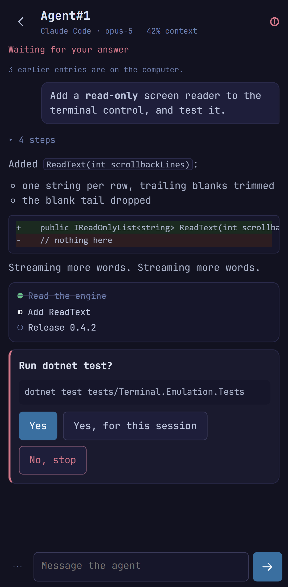

<p align="center">
  
</p>


# mTiles

**Close the window. Open it tomorrow. Your agents are still mid-conversation.**

mTiles helps developers — and vibe coders — get real, professional work done with AI agents: faster,
more comfortable, and with far less stress than juggling several terminals by hand.


## What it does

**Goal tile — give it a goal, walk away.** Clarifies what you want, writes a plan, implements it,
reviews its own work, and loops until it's done. Runs unattended for hours — 10-20 hours on one goal is
normal. Snapshots your working tree first, so nothing is ever at risk.

<p align="center">
  
</p>

**Reopen and carry on.** Close mTiles, reopen it — every agent tile resumes exactly where it left off,
same conversation.

**Five agents, any account.** Claude Code, OpenCode, Codex, pi, Antigravity. Run several accounts and
providers side by side.

**Self-healing on crash.** A crashed agent restarts itself automatically.

**Usage tile — every account's limits, at a glance.** Claude, Codex, Antigravity, OpenRouter: one card
per account, one bar per window.

<p align="center">
  
</p>

**Query your databases, safely.** Any agent can query SQL Server or PostgreSQL through a local bridge —
no password exposed, writes blocked by default.

**Your agents in your pocket.** Pair a phone once with a QR code and follow every workspace from it:
the layout drawn to scale, any tile zoomed into, an agent's conversation as it happens — answer its
questions and approvals, type or dictate into it, press its keys. No port is opened: both ends connect
out to a relay, so it works from anywhere. **And dictate** — speak instead of typing, from the keyboard
or the phone.

<p align="center">
  
</p>

**The rest.** Git, Note, Todo and Terminal tiles too. Any tile can change kind in place.

**Workspaces and split tiles.** One directory, layout and branch per workspace; switching
is instant because terminals are never killed. Split any tile in either direction, or press
Ctrl+Shift+F to give one the whole window. Drag a tile by its header: onto another tile's edge to
split it, onto its middle to swap the two, onto the gap between two tiles to put it between them, or
onto the edge of the workspace to give it a column or a row of its own.

**Arrange the window, not only the workspace.** The workspace list is a tile too: drag it by its
header to the right, the top or the bottom, and along an edge it turns into a row of tabs. Split it to
put a note, a todo list or the usage dashboard beside the workspaces — narrow, so the workspace keeps
the room. A magenta hint means the drop goes into the window's layout, a blue one into the
workspace's.

**One palette drives everything.** The terminal's ANSI colours set every surface in the UI. 17 themes,
dark and light.

## Running

```
git clone https://github.com/b-y-t-e/mTiles.git
cd mTiles
dotnet run --project src/mTiles
```

Requires [.NET 10 SDK](https://dotnet.microsoft.com/download).

**Dropping files/images onto a tile does nothing when mTiles runs as administrator** (e.g. from an elevated IDE): Windows blocks drags from Explorer into elevated processes (UIPI). Run it unelevated.

### Linux (AppImage)

Releases ship a self-contained `mTiles-linux-x86_64.AppImage`. Two things it cannot bring with it:

**FUSE 2.** AppImages mount themselves through `libfuse.so.2`, and Arch-based systems — CachyOS, Omarchy
— ship only FUSE 3 by default. Without it the application does not start at all, and the error mentions
`libfuse.so.2` rather than mTiles. Either install it (`sudo pacman -S fuse2`) or skip the mount
entirely:

```
./mTiles-linux-x86_64.AppImage --appimage-extract-and-run
```

Also worth knowing: Avalonia is an X11 application, so on Wayland desktops (Hyprland, KDE) it runs
through **XWayland**; and dictation needs ALSA (`libasound.so.2`, provided by `alsa-lib`/`pipewire-alsa`)
for the microphone — the phone bridge does not, since that audio arrives over the network.

## Tech

.NET 10, Avalonia 12, CommunityToolkit.Mvvm, AvaloniaEdit, and **Terminal.Avalonia** — our own terminal control (VT engine, ConPTY/forkpty, rendering), written for this app and published on NuGet.

## Roadmap

<details>
<summary>The things known to be missing or wrong, roughly in the order they bother us.</summary>

Not promises with dates — the things known to be missing or wrong, roughly in the order they bother us.

**Known limitations**

- **Restarting a shell can stall the UI** for as long as the child takes to die (up to ~2 s). The terminal control kills the old session on the UI thread; fixing it belongs in `Terminal.Avalonia`, not here.
- **Selection inside a full-screen TUI needs Shift held.** mc, vim and opencode grab the mouse, and the terminal control deliberately refuses a one-way override that would leave those apps unable to receive clicks. It is the xterm convention, but a habit to learn.
- **`cmd` is not offered as a shell.** It cannot run what an agent tile's launch chain is made of: it does not parse its command line by the rules the PTY backend quotes with, runs only the first line of a multi-line command, and does not treat `;` as a separator, so a chain of more than one command cannot work there. It used to be offered and then silently swapped for PowerShell behind your back, which meant a shell that was neither the one you picked nor the one running your commands. The shells are PowerShell, Git Bash, bash, zsh and fish; a settings file naming `CMD` falls back to the default.
- **Shell profiles and the AI Tools table are gone.** A profile was a name, a shell, a startup script, a fallback and the binary that had to be installed for it to appear — everything an AI CLI needed, written out by hand and kept working by hand. Those are now the agent's own business, so Settings has neither tab. Your existing tiles are migrated: a terminal running one of the four seeded AI profiles becomes an agent tile on the first launch of that workspace, and a copy of the layout as it was is kept beside it as `{id}.pre-agents.json`. A profile you wrote yourself is **not** migrated — it names no agent this application knows — and its tile comes back as a plain shell on the shell it was running, without the script. If that is a loss, the file above is the copy of what it was.
- **A shell nominated by path is gone.** The old Settings → General "custom shell" (path + arguments) has been removed: a shell is now one of the known kinds, because mTiles has to know how to quote for it, how to run a single command in it and how to unset a variable in it — none of which it can work out from a path to an arbitrary binary. If you had pointed it at nushell, a bash outside the usual places or a WSL wrapper, your terminals now start in the default shell instead, and the log (`%APPDATA%/mTiles/logs/`) says once what was dropped. The setting is not coming back in that form; a shell arriving as a class is. **The same applies to a default shell picked from a list**: on Linux and macOS that list used to hold whatever `$SHELL` pointed at, of any kind, so if yours was `nu`, `ksh` or `dash` it is no longer known either — your terminals start in the default shell and the log says once what was named. On Windows the same line covers `CMD`.
- **Text wins over images on paste.** When the clipboard holds both (a browser copy, a screenshot tool), Ctrl+V pastes the text and the agent never sees the image. Alt+V still hands it over **on Windows and WSL**, which are the two platforms Claude Code binds it on; on Linux and macOS it binds Ctrl+V for images and nothing else, so there a picture copied alongside text cannot be handed over at all — copy the picture on its own. The Goal tile's own composer is unaffected: its Alt+V is mTiles reading the clipboard rather than the agent, and it works everywhere.
- **On Linux an agent needs `wl-clipboard` or `xclip` to see an image at all.** No AI CLI carries a clipboard of its own there — they run one of those two programs — and when neither is installed the paste does nothing and says nothing, which looks exactly like mTiles having eaten the keystroke. The Arch package installs both with mTiles; everywhere else Settings → AI says so and offers to run your package manager in a tile.
- **Codex's session is worked out rather than told, and it can be wrong.** codex names its own conversation and never says what it chose, so mTiles finds the rollout file it left behind: the newest one started since this tile did, recording this tile's working directory, and not already held by another open tile. Two codex tiles started in the same second in the same workspace can still, in principle, take each other's — in which case one of them resumes the wrong conversation on the next launch. agy is asked outright and has no such ambiguity.
- **OpenCode's session file is an undocumented format.** Resume works by handing `opencode import` a small JSON document mTiles writes — opencode's own *export* format, not an API, measured against **1.18.14**. If a future opencode changes it, the import fails, the resume after it finds no session, and the tile falls through to a plain shell: history lost, tile intact. `OpenCodeSessionTests` is what turns that into a failing build rather than a surprise.

- **A paired phone reaches mTiles through Tailscale's public relays.** Both ends connect out, so nothing on your computer listens to the network; the relay passes end-to-end encrypted bytes it cannot read, and sees only that two keys talk. That includes your dictated audio and your agents' conversations while the phone is watching them. The encryption is [tailcat-link](https://github.com/b-y-t-e/tailcat-link)'s, whose design has not been reviewed outside that project. Recognition still runs on the machine mTiles is on; dictating from the local microphone is unchanged.
- **The phone page is hosted on GitHub Pages**, because a browser gives the microphone only to an https page and mTiles no longer serves one. The pairing code rides in the link's `#fragment`, which never reaches GitHub. Anything able to run script on that page could use the pairing, so it loads nothing from anywhere else and never renders an agent's text as HTML.

**Planned**

Two of these are worked out in detail in [`docs/ROADMAP.md`](docs/ROADMAP.md) — what is wrong now, what
the stopgap is, and what would settle it — so that picking one up does not begin by rediscovering why it
is there.

- **A model field that shows it has a list.** The agent instance form's Model and Fast model fields
  complete against the provider's own catalogue — hundreds of entries, matched by every typed word in
  any order — but `AutoCompleteBox` has no arrow and nothing to click, so a field with a full list
  behind it looks like an empty text box. `ComboBox IsEditable` has the arrow and cannot filter. What is
  wanted is one control that does both; the options, in cost order, are in the roadmap document.
- **A tile header that is an index, a kind and a description.** The tile's name is doing two jobs at
  once: the label somebody typed and the generated `Agent#1` nobody chose. The end state is three
  separate things — a position label assigned in reading order, the kind (already a glyph), and a
  description the user writes — with `Ctrl`+the label focusing that tile, on a shortcut that has to be
  configurable because `Ctrl+1` belongs to whatever is running inside the tile.
- **Goal tile — the rest of the line.** Attachments are now done: a screenshot pasted into the composer with Ctrl+V (or Alt+V when the clipboard also holds text) is written beside the goal and handed to every prompt of the run as a path, with an `[Image #N]` marker left where the caret was. Everything else on this line is done too: the tile is drawn as a terminal transcript with phase colours from the ANSI palette; the review returns structured findings at four severities — blocker, error, warning, suggestion — rather than the substring `VERDICT: PASS`; when a goal is finished is set on the tile itself — tolerated errors and warnings (blockers never are), attempts, which of the SOLID principles apply, and whether the work has to leave the project building and its tests passing; the clarification round can be skipped when the goal is already clear and repeated while it is not; a goal can be worked out from the uncommitted changes instead of typed; a run that used up its attempts can be given more without losing the conversation; and each attempt starts a fresh tool process but is handed what the earlier ones changed and decided against.
- **A warning while you type, not after you send.** The Goal tile's composer takes two things that name something outside the text — `@` file mentions and `[Image #N]` markers — and both fail silently when they are left half-finished. Backspacing into `[Image #4]` leaves `[Image #4`, which stops being a marker: the picture is correctly dropped from the run, but nothing on screen says so, and the goal is sent describing an image the tool was never given. An `@` mention is looser still, because mTiles attaches nothing for it — the path is plain text in the prompt — so `@tests/mTiles.Tests/AssemblyIn` costs the run a tool call that finds nothing. The composer should say so before Send: a quiet line under the box naming what will not resolve, on a debounce so it does not flicker per keystroke, checking three things — that every `[Image #N]` is whole and has an image behind it, that every `@` path exists on disk, and that the brackets and quotes a mention needs are balanced. Open questions: whether it is a warning or a refusal (it must not be a refusal — a path can legitimately name a file the tool is about to create); whether the file check is worth a stat per mention on every pause in typing, or should reuse the mention source's own cached listing; and how it reads for a goal that deliberately mentions something that does not exist yet.
- **Favourite tiles.** Nothing marks the two or three tiles you actually live in, so finding them in a workspace that has grown means reading every header. Tiles should be markable as favourites and reachable directly — a short list, keyboard-first, ordered by the user rather than by the tree. Open questions: whether a favourite is scoped to its workspace or global, and what happens to one whose tile is closed — dropped silently, or kept as a way to reopen it.
- **Review tile.** Code review belongs beside the code, not in a browser: a tile that shows a diff — the working tree, a branch against another, or a pull request — and lets comments be written against lines and handed to an AI tool or pushed back to the forge. The Git tile already renders diffs and knows the repository, so the question is whether this is a second tile or a mode of that one, and how much of a pull request it can honestly show without becoming a GitHub client.
- **A first run with no agent installed should offer to install one.** The agent tile's chooser lists the agents that are actually on this machine, and on a fresh machine that list is empty — which is the correct answer and a useless screen. A short wizard at startup should name the agents mTiles knows, say which are installed, and offer to install one, running the install in a visible terminal tile rather than silently. Open questions: whether it appears once or whenever nothing is installed; how much it should promise on Linux and macOS, where each agent's installer differs; and whether an installation that needs elevation is offered at all or only described.
- **More subscriptions through CCS.** Claude Code already runs on a Codex subscription through [CCS](https://github.com/kaitranntt/ccs)'s local OAuth proxy — installed, signed in and started from Settings → AI. The proxy also speaks to Gemini, Kimi, xAI and others; choosing one of those on the form, each with its own sign-in and its own model names, is what is left. Details in [`docs/ROADMAP.md`](docs/ROADMAP.md).

</details>

## License

MIT

---

*"The light shines in the darkness, and the darkness has not overcome it" John 1:5*
